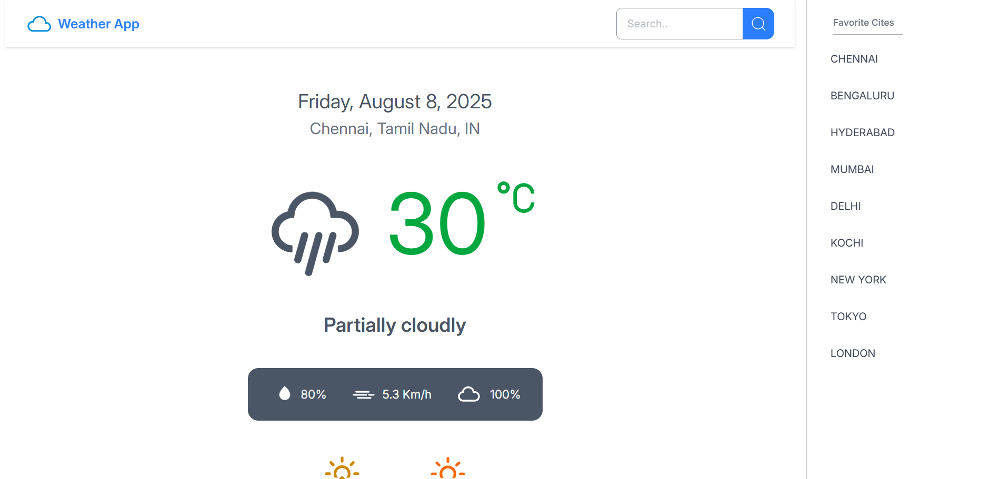
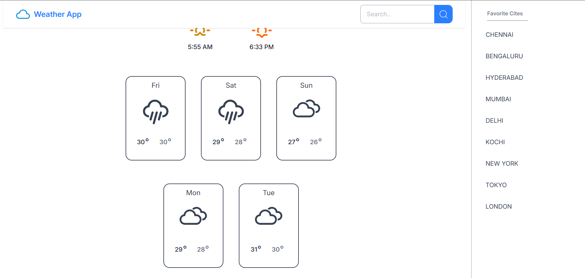

# 🌤️ Weather App

**Weather App** is a modern, responsive web application built using **React** and **Tailwind CSS**. It fetches real-time weather data from the [OpenWeather API](https://openweathermap.org/api) and displays it in a clean and user-friendly interface.

---

## 🚀 Features

- 🔍 Search for any city to get current weather info
- 🌡️ Shows temperature, humidity, wind speed, and more
- 📱 Fully responsive design with Tailwind CSS
- ⚡ Fast and lightweight React app

---

## 🛠️ Built With

- [React](https://reactjs.org/) – JavaScript library for building user interfaces
- [Tailwind CSS](https://tailwindcss.com/) – Utility-first CSS framework
- [OpenWeather API](https://openweathermap.org/api) – For weather data

---


## 📸 Preview

  
  

---

## 📦 Installation

```bash
git clone https://github.com/your-username/weather-app.git
cd weather-app
npm install
npm start